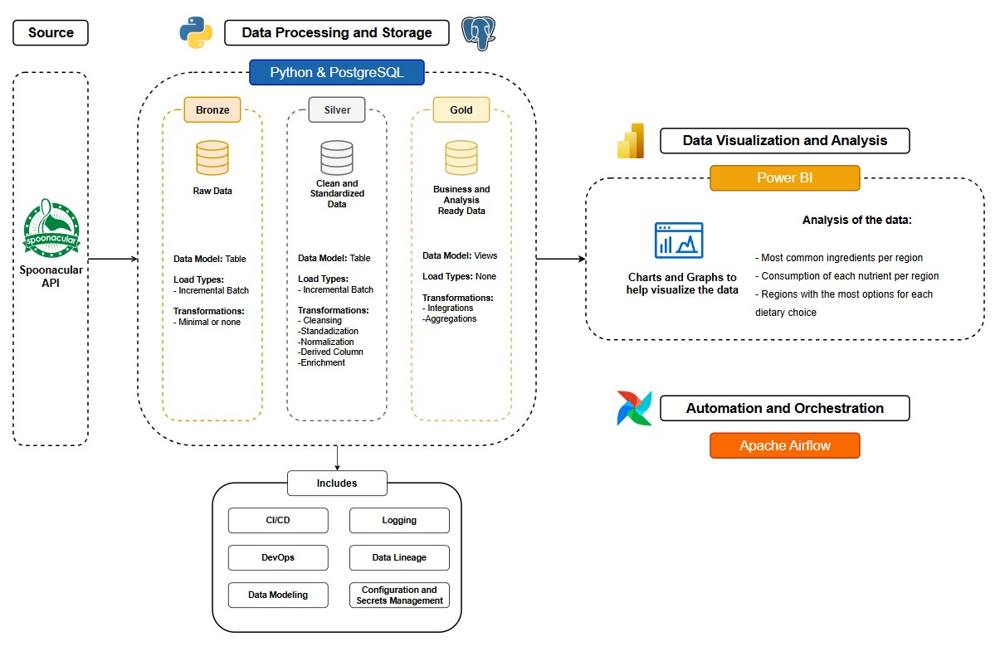
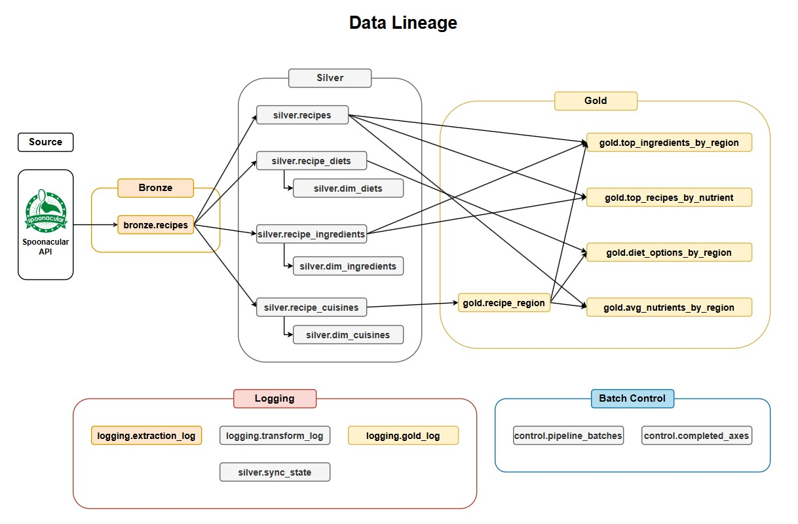

# 🍽️ recipes-etl-pipeline Project

#### The recipe-etl-pipeline is an End-to-End Data Engineering project that seeks to provide insights about the nutrition and ingredients of different cuisines in the world, as well as give recipe ideas to anyone curious about the nutritional value of the recipe, or looking for recipes that match their diet criteria.

Would you like to find recipes with high protein?

Or maybe you're looking for a vegetarian option?

Want to know how many carbs you're eating?

A mix of all of those?

This can help you find an answer.

The Project was made as a Portfolio project and aims to showcase skills in: **API data extraction; Medallion Architecture; Logging; Data Modelling; CI/CD; Data Lineage; DevOps; Schedulling; Automation and more.**

---

# 📜 **Project Overview**

By using Python, Airflow and PostgreSQL, the project consists in extracting data from the Spoonacular API and implementing a Medallion Architecture to extract insights from this data, and include proper logging, CI/CD, DevOps, automation, data visualizations , and Data modelling.

## 🏗 **Data Architecture**




🥉 **Bronze Layer:** Stores raw data as-is from the source systems or with minimal parsing. Data is ingested from the Spoonacular API into PostgreSQL.

🥈 **Silver Layer:** Data cleansing, standardization, and normalization processes to prepare data for analysis.

🥇 **Gold Layer:** Business-ready data modeled into a star schema required for reporting and analytics.


## 🧬 **Data Lineage**



## 🏛️ **Repository Structure**

```
recipe-pipeline/
├── README.md
├── docs/
│   ├── data_lineage.jpeg
│   └── project_architecture.jpeg
├── pipeline/
│   ├── extract.py
│   ├── transform.py
│   └── gold.py
├── dags/
└── tests/
```

---

## 🛠️ **Technologies Used**

| Tool           | Purpose                                      |
| -------------- | -------------------------------------------- |
| **PostgreSQL** | Data warehouse database                      |
| **pgAdmin**    | Database management and query development    |
| **Python**     | Writing scripts and automation               |
| **Airflow**    | Orchestration and automation                 |
| **PowerBI**    | Data Visualization                           |
| **Draw.io**    | Diagrams                                     |
| **Claude AI**  | Brainstorming and some code generation       |
---

## 📝 **Project Requirements**

### Objective:
Develop an End-to-End data Pipeline using Python, SQL and Airflow to consolidate cuisine, nutrition and ingredient data, enabling analytical reporting.

### Specifications
- **Data Sources**: Spoonacular API(requires a key)
- **Data Quality**: Cleanse and resolve data quality issues prior to analysis.
- **Integration**: User-friendly data model designed for analytical queries.
- **Documentation**: Provide clear documentation of the data model to support analysis.

---

# ⚠️ Known Issues
Spoonacular API contains data quality issues. The "nameClean" parameter is supposed to contain only proper ingredient names, however, sometimes it still contains other information.
To try and combat this, there are several steps in the "transform.py" to address these using logical patterns, however, due to the variety and uniqueness of these exceptions, some of them end up inside the clean the Silver Layer. 

**From the Spoonacular API:**
```
The nameClean field is designed to provide a simplified, cleaned-up version of an ingredient’s name by removing quantities, measurements, and some extraneous details. However, it may sometimes still contain instructions or extra descriptors because:

- Parsing Limitations: The cleaning algorithm may not perfectly capture and remove all instructional text or extra descriptions, especially if the original ingredient description is complex or formatted unusually.
- Ambiguity in Text: Some instructions or descriptors might be closely integrated into the ingredient name, making it difficult to distinguish them as separate from the core ingredient name.
- Variability in Data Sources: The original ingredient data may come from diverse sources with inconsistent formatting, which can introduce instructions or notes within the ingredient string that are hard to fully clean.

So, while nameClean is simplified, it might still include some instructions or details if they are inseparable from the core ingredient name in the source data or if the cleaning process doesn’t identify them as removable text.
```

---

# 👉 Disclaimer

The analysis made does not contain personal opinions and it's limited by the data provided by the Spoonacular API.

---

# ⚖️ License

This project is licensed under the MIT License. You are free to use, modify, and share this project with proper attribution.